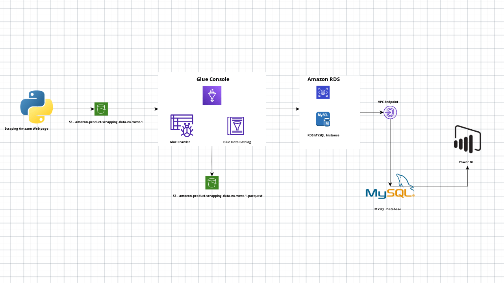

# Portfolio-Projects

## Induction

 This project demonstrates ETL tasks of web scrapped semi-structured data  and 
data migration from a cloud data lake to an on-premises MYSQL data base.
Additionally, we utilized MYSQL database to perform data analytics 
,enabling us to get informed data insights from the dataset.

## Project Goals

1. Data Scrapping - Scraping laptop data from Amazon product page using Selenium open-source frame work.Autonomating the selection of 
   brand-wise data and scraping over a given number of pages,then storing as json file with brand name.
2. Data Lake - Uploading scraped raw data into AWS S3 data lake , where we can store any type of data structure at any scale.
3. ETL Tasks - Transforming JSON  data into Parquet format and loading it into AWS RDS(Amazon Relational Database Service).
4. Data base connnections - Using VPC end point connecting RDS to an on-premises MYSQL data base.
5. Data Cleaning and Data anlaytics - Utilizing MySQL for data cleaning and conducting data analytics on discounted products.
6. Data Visulizing - Observing data insights using Power BI.

## Used Technologies

1. Python
2. AWS S3
3. AWS Glue
4. AWS RDS
5. IAM
6. VPC
7. MYSQL
8. Power BI
   
## Architecture Diagram

 
